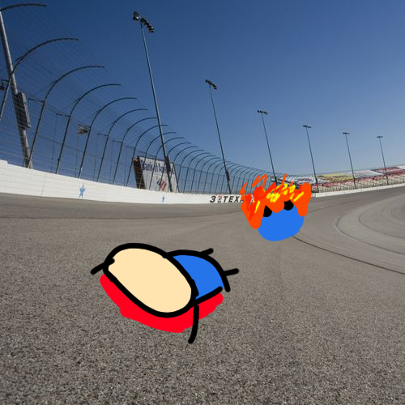

# RIP  
You begin to weave in and out of the starting area. You begin to catch speed as other racers stare at you like you are some kind of monkey. You slam into a vehicle in front of you and fly out of the windshield, landing 50 feet in front of your vehicle. You are picked up my paramedics and later die of your injuries. You should of put your seatbelt on...  

  

